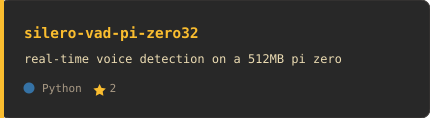
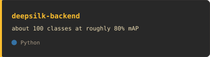
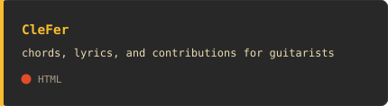

### `~/pinned`

<table>
<tr>
<td width="50%"></td>
<td width="50%"></td>
</tr>
<tr>
<td width="50%"></td>
<td width="50%"></td>
</tr>
<tr>
<td width="50%"></td>
<td width="50%"></td>
</tr>
</table>

### `~/contact`

<table>
<tr>
<td width="50%"></td>
<td width="50%"></td>
</tr>
<tr>
<td colspan="2"></td>
</tr>
</table>
