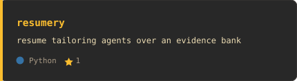
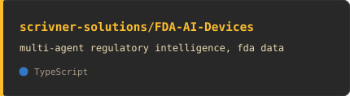
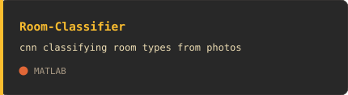

### `~/pinned`

<table>
<tr>
<td width="50%"></td>
<td width="50%"></td>
</tr>
<tr>
<td width="50%"></td>
<td width="50%"></td>
</tr>
<tr>
<td width="50%"></td>
<td width="50%"></td>
</tr>
</table>

### `~/contact`

[linkedin](https://linkedin.com/in/duyleq) · [danielqle19@gmail.com](mailto:danielqle19@gmail.com) · open to software, data platform, and AI engineering roles

